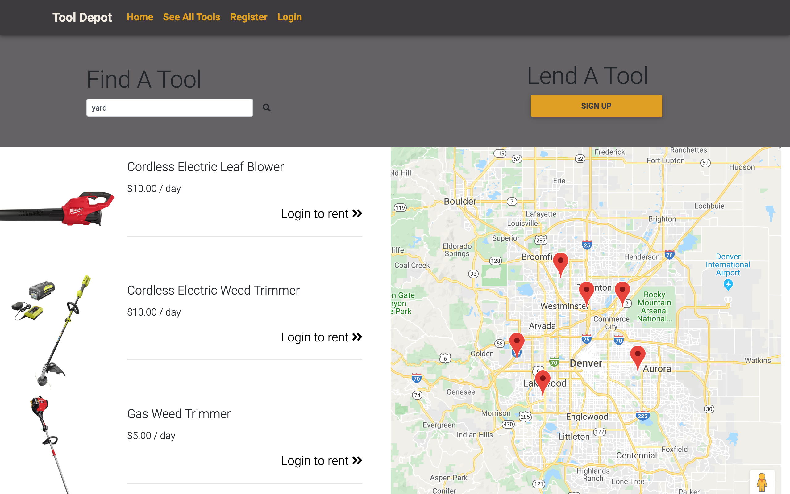

## Full Stack Final Project
Week 16 Final team project for Skill Distillery
### Tool Depot
#### Team Crescent Ribbons
Members:
* Joe Debroux (Back End Developer, Repo Owner)
* Josh Howell (Back End Developer, DBA)
* Alicia Glassmeyer (Front End Developer, Scrum Master)
* Cody Fulker (Front End Developer)
* Justin Choi (Back End Developer)
### Overview
Tool Depot is a web application where users can list tools for others in their
community to rent. Users in need of a tool can login, see a list of all available
tools, search by tool name, see results on a map, and begin a rental transaction.
All users can see their tool rental transactions and list of tools, and update
their profile information.
### Viewing the project
[Hosted live on AWS ](http://18.222.90.180:8080/ToolDepot/)
* Login credentials for Admin- username: admin password: admin
* Login credentials for User- username: joe password: joe

Home Page

User Page

Admin Page

Search For Tool Page

See All Tools Page

Tool Transaction Page

Database Structure

### Technologies Used
* Java, JPA
* Spring Boot, Spring Security, Spring Tool Suite
* MySQL, MySQL Workbench
* Angular, MDBootstrap
* HTML, CSS
* Git, Github
* Agile, pair programming
* Trello
* Postman
* Visual Studio Code
### Lessons Learned
Communication between team members is crucial. Everyone needs to be on the same
page at all times, it greatly improves morale and project workflow. Try to set up
projects in a way that evenly distributes work among team members and use pair
programming when you can.
Don't use reserved words in your database tables. It will cause SQL errors that
can be very difficult to debug. Build your database with stretch goals in mind.
### Stretch Goals
Connect skills to the front end so that skills/services can be offered for hire
in addition to tool rentals.
Add an availability calendar to the tool rentals, so a user can search for tools
to rent for future projects.
Add email capability between admin and users.
